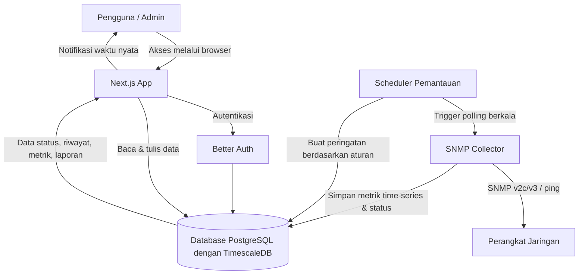
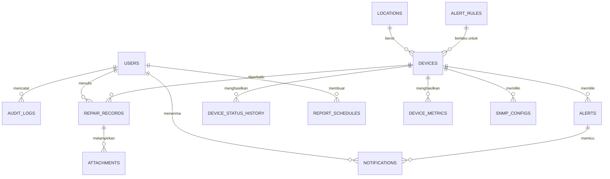

# PRD — Project Requirements Document

## 1. Overview
Masalah yang ingin diselesaikan adalah proses troubleshooting jaringan kantor yang masih lambat karena petugas harus memeriksa perangkat satu per satu dan tidak memiliki gambaran kondisi jaringan secara cepat. Aplikasi ini dibuat agar tim IT dapat melihat semua perangkat jaringan dalam satu peta, memantau statusnya secara otomatis, menerima peringatan saat ada masalah, serta mencatat riwayat perbaikan dan menghasilkan laporan berkala. Tujuan utamanya adalah mempercepat tanggap gangguan dan memberikan pengalaman yang mudah dipakai untuk seluruh petugas yang mengoperasikannya.

Dari sisi pengalaman pengguna, aplikasi ini dirancang dengan prinsip UI/UX modern yang interaktif, tidak kaku, dan responsif di setiap perangkat. Seluruh antarmuka menggunakan animasi transisi yang halus, memberikan feedback visual yang jelas saat elemen diklik atau diubah, serta menampilkan dashboard yang dinamis agar informasi jaringan terasa hidup dan mudah dipantau. Tampilan aplikasi harus optimal digunakan dari desktop, tablet, maupun smartphone, sehingga petugas tetap dapat mengakses informasi penting saat berada di lapangan. Pendekatan desain yang digunakan adalah dashboard berbasis widget yang dapat disesuaikan, sehingga setiap pengguna dapat mengatur tata letak informasi sesuai kebutuhan dan perannya masing-masing.

## 2. Requirements
- Aplikasi berbasis web sehingga dapat diakses dari browser tanpa instalasi tambahan.
- Antarmuka harus sederhana dan mudah dipahami oleh petugas IT dengan berbagai tingkat pengalaman.
- Aplikasi menampilkan peta jaringan yang menggambarkan posisi dan status seluruh perangkat.
- Sistem harus memantau kesehatan perangkat secara berkala dan otomatis.
- Peringatan gangguan dapat dikirim ke pengguna tanpa harus terus-menerus melihat layar.
- Riwayat status perangkat dan riwayat perbaikan terdokumentasi dengan rapi.
- Laporan kondisi jaringan dapat dibuat otomatis dan diekspor sesuai kebutuhan.
- Akses aplikasi dibatasi oleh sistem login dan peran pengguna yang jelas.
- Semua aktivitas penting pengguna tercatat untuk keperluan audit dan keamanan.

## 3. Core Features
### Fase 1 — Peta Jaringan
- **Peta Jaringan** — Menampilkan seluruh perangkat jaringan pada satu peta agar kondisi kantor terlihat langsung.
  - **Tampilan Peta** — Melihat posisi perangkat jaringan dalam bentuk peta grafis yang mudah dipahami.
  - **Detail Perangkat** — Mengklik perangkat di peta untuk melihat informasi dan statusnya secara cepat.
  - **Filter Lokasi** — Menyaring peta berdasarkan area atau gedung agar fokus pada bagian yang diperiksa.
  - **Status Ringkas** — Menunjukkan perangkat sehat atau bermasalah dengan kode warna langsung di peta.

### Fase 2 — Pemantauan Perangkat
- **Pemantauan Perangkat** — Memantau kesehatan semua perangkat jaringan secara berkala dan melihat riwayatnya.
  - **Daftar Perangkat** — Melihat seluruh perangkat beserta status terkini dalam satu daftar.
  - **Detail Riwayat** — Membuka riwayat ketersediaan perangkat untuk melihat gangguan yang pernah terjadi.
  - **Perangkat Prioritas** — Menandai perangkat penting agar mendapat perhatian khusus saat bermasalah.
  - **Uji Koneksi** — Menjalankan pemeriksaan koneksi sederhana ke perangkat dari aplikasi.

### Fase 2 — Peringatan Otomatis
- **Peringatan Otomatis** — Memberi tahu petugas dengan segera ketika perangkat bermasalah atau putus.
  - **Notifikasi Waktu Nyata** — Menerima peringatan langsung begitu gangguan terdeteksi tanpa harus melihat layar terus.
  - **Aturan Peringatan** — Membuat batas kondisi tertentu yang memicu peringatan agar tidak salah alert.
  - **Riwayat Peringatan** — Melihat semua peringatan terdahulu beserta tindak lanjutnya.

### Fase 3 — Riwayat Perbaikan
- **Riwayat Perbaikan** — Mencatat setiap proses perbaikan jaringan agar jejak masalah terdokumentasi.
  - **Tambah Catatan** — Mencatat detail perbaikan seperti gejala, tindakan, dan hasilnya.
  - **Lampirkan Foto** — Menyimpan foto atau dokumen pendukung pada tiap catatan perbaikan.
  - **Status Tindak Lanjut** — Menandai perbaikan masih berjalan atau selesai agar tidak terlewat.

### Fase 4 — Laporan Berkala
- **Laporan Berkala** — Menghasilkan laporan kondisi jaringan secara otomatis untuk evaluasi rutin.
  - **Jadwal Laporan** — Mengatur laporan dikirim otomatis harian, mingguan, atau bulanan sesuai kebutuhan.
  - **Ekspor Laporan** — Mengunduh laporan dalam file agar mudah dibagikan ke pimpinan.
  - **Grafik Ringkasan** — Melihat ringkasan tren gangguan dan kinerja jaringan dalam bentuk grafik.

### Fase 5 — Kelola Pengguna
- **Kelola Pengguna** — Mengatur siapa yang boleh mengakses aplikasi beserta tingkat wewenangnya.
  - **Daftar Pengguna** — Melihat dan menambahkan pengguna aplikasi dari satu halaman.
  - **Peran & Hak Akses** — Memberikan peran berbeda, misalnya admin atau petugas, agar akses sesuai tugas.
  - **Audit Aktivitas** — Melihat jejak aktivitas pengguna untuk keperluan keamanan.

### Fase 5 — Masuk Aplikasi
- **Masuk Aplikasi** — Proses autentikasi agar hanya pengguna terdaftar yang dapat membuka aplikasi.
  - **Login & Logout** — Masuk dan keluar dari aplikasi dengan aman.
  - **Lupa Kata Sandi** — Membantu pengguna mendapatkan kembali akses saat lupa kata sandi.

### Fase 2 — Dashboard NOC
- **Dashboard NOC** — Menyediakan satu layar ringkasan untuk memantau kondisi jaringan secara langsung.
  - **Ringkasan Status Global** — Menampilkan jumlah total perangkat online, offline, dan peringatan aktif dalam satu pandangan.
  - **Grafik Metrik Utama** — Memvisualisasikan performa jaringan seperti latensi atau uptime dalam grafik real-time. Grafik ini juga mencakup pemantauan throughput Ethernet (upload/download), penggunaan bandwidth Queue, serta status trafik/tunnel VPN.
  - **Daftar Peringatan Terbaru** — Menampilkan widget berisi log gangguan terbaru yang memerlukan tindakan segera.
  - **Widget Akses Cepat** — Menyediakan tombol navigasi ke peta jaringan atau perangkat yang sedang bermasalah.

### Fitur Lanjutan (Referensi NMS Modern)
- **Fitur Lanjutan** — Melengkapi kemampuan pemantauan dengan pola kerja NMS modern seperti Zabbix atau PRTG.
  - **Otomasi Penemuan Perangkat (Auto-Discovery)** — Mendeteksi perangkat baru secara otomatis berdasarkan rentang IP atau protokol SNMP sehingga tidak perlu ditambahkan manual satu per satu.
  - **Prediksi Kapasitas (Capacity Planning)** — Menganalisis tren historis untuk memperkirakan kapan storage atau bandwidth akan mendekati batas penuh, sehingga dapat dicegah sebelum terjadi gangguan.
  - **Eskalasi Peringatan Bertingkat** — Mengirim peringatan ke admin pertama; jika tidak ada respons dalam jangka waktu tertentu, peringatan otomatis diteruskan ke supervisor atau level berikutnya.
  - **Monitoring Topologi Logis (Dependency Tracking)** — Mendeteksi hubungan ketergantungan antarperangkat; jika perangkat utama mati, perangkat di bawahnya ditandai sebagai *unreachable* dan bukan *down* untuk mengurangi banjir notifikasi (*alert storm*).

### Fase 6 — Pengoptimalan Jaringan Berbasis AI
- **Pengoptimalan Jaringan Berbasis AI** — Menganalisis log MikroTik dan data metrik SNMP menggunakan kecerdasan buatan untuk menghasilkan rencana optimasi perangkat dan jalur LAN.
  - **Analisis Log & Metrik AI** — Mengevaluasi log sistem, error, anomali trafik, dan metrik SNMP secara otomatis guna mendeteksi bottleneck serta pola beban tinggi.
  - **Rekomendasi Jalur & Topologi LAN** — Memberikan rekomendasi perbaikan rute atau distribusi beban pada jalur LAN yang sering mengalami kemacetan atau packet loss.
  - **Rencana Optimasi Perangkat** — Menghasilkan saran konfigurasi MikroTik (seperti penyesuaian Queue/QoS, firewall rule, dan alokasi resource) untuk meningkatkan performa perangkat.
  - **Simulasi & Action Plan** — Menyajikan panduan langkah-demi-langkah yang siap dieksekusi teknisi untuk mengoptimalkan efisiensi jaringan.

## 4. User Flow
1. Pengguna membuka aplikasi dan melakukan **login** menggunakan akun yang terdaftar. Jika lupa kata sandi, pengguna dapat memulihkannya melalui tautan **Lupa Kata Sandi**.
2. Setelah masuk, pengguna melihat **Peta Jaringan**. Peta menampilkan perangkat dengan kode warna: hijau untuk sehat, merah untuk bermasalah, dan abu-abu untuk perangkat mati.
3. Pengguna dapat **memfilter peta berdasarkan lokasi** agar lebih fokus pada area tertentu.
4. Pengguna **mengklik perangkat** yang bermasalah untuk melihat detail perangkat dan riwayat statusnya.
5. Sistem melakukan **pemantauan berkala**. Saat gangguan terdeteksi, sistem otomatis mengirim **notifikasi waktu nyata** kepada petugas.
6. Petugas membuka **Daftar Perangkat**, mencari perangkat yang bermasalah, lalu menjalankan **Uji Koneksi** untuk memverifikasi kondisi terkini.
7. Jika diperlukan perbaikan, petugas menambahkan **Riwayat Perbaikan** berisi gejala, tindakan, hasil, foto pendukung, dan status tindak lanjut.
8. Sistem menghasilkan **Laporan Berkala** sesuai jadwal. Laporan juga dapat diunduh atau diekspor untuk dibagikan ke pimpinan.
9. Admin secara berkala meninjau **Daftar Pengguna**, mengubah **peran & hak akses**, dan memeriksa **Audit Aktivitas** untuk memastikan penggunaan aplikasi aman.

## 5. Architecture
Aplikasi ini menggunakan arsitektur full-stack dalam satu platform web. Pengguna mengakses antarmuka melalui browser, lalu server menangani logika aplikasi, komunikasi dengan database, pemantauan perangkat, dan pengiriman notifikasi. Untuk pengambilan metrik dari perangkat MikroTik, aplikasi dilengkapi dengan **SNMP Collector** yang berkomunikasi menggunakan SNMP v2c/v3.

Penjelasan alur:
- **Browser** digunakan pengguna untuk melihat peta jaringan, daftar perangkat, laporan, dan halaman pengelolaan.
- **Next.js App** menjadi pusat aplikasi yang menangani tampilan, API, dan logika bisnis seperti pengelolaan perangkat, perbaikan, dan laporan.
- **Better Auth** menangani login, logout, lupa kata sandi, serta pengaturan sesi pengguna.
- **Database PostgreSQL dengan TimescaleDB** menyimpan seluruh data pengguna, perangkat, status, peringatan, riwayat perbaikan, jadwal laporan, audit, serta metrik time-series hasil polling SNMP.
- **Scheduler Pemantauan** berjalan otomatis pada interval tertentu. Scheduler memicu SNMP Collector untuk mengambil data dari perangkat, memperbarui status, dan membuat peringatan saat ditemukan masalah.
- **SNMP Collector** adalah komponen backend yang melakukan polling data ke perangkat MikroTik menggunakan SNMP v2c/v3. Komponen ini mengambil data status interface, traffic Queue, Ethernet, VPN, serta metrik performa perangkat (CPU, RAM, latensi) dan menyimpannya ke database untuk ditampilkan dalam grafik historis.

## 6. Database Schema
Berikut tabel-tabel utama yang dibutuhkan untuk mendukung seluruh fitur aplikasi.

| Tabel | Kolom Utama | Tipe | Kegunaan |
|---|---|---|---|
| **users** | id | integer / uuid | Identitas unik pengguna. |
|  | name | string | Nama lengkap pengguna. |
|  | email | string | Alamat email untuk login. |
|  | password_hash | string | Kata sandi yang dienkripsi. |
|  | role | string | Peran pengguna: `admin` atau `petugas`. |
|  | created_at | timestamp | Waktu akun dibuat. |
| **devices** | id | integer / uuid | Identitas unik perangkat. |
|  | name | string | Nama perangkat, contoh: Switch Lantai 2. |
|  | type | string | Jenis perangkat, contoh: router, switch, access point. |
|  | ip_address | string | Alamat IP perangkat untuk pemantauan. |
|  | location_id | integer / uuid | Lokasi perangkat berada. |
|  | is_priority | boolean | Menandai perangkat prioritas. |
|  | status | string | Status terkini: `online`, `offline`, atau `warning`. |
|  | last_seen | timestamp | Waktu terakhir perangkat terdeteksi aktif. |
|  | created_at | timestamp | Waktu perangkat ditambahkan. |
| **locations** | id | integer / uuid | Identitas unik lokasi. |
|  | name | string | Nama lokasi, contoh: Gedung A, Lantai 1. |
| **device_status_history** | id | integer / uuid | Identitas unik riwayat status. |
|  | device_id | integer / uuid | Perangkat yang dicatat statusnya. |
|  | status | string | Status pada saat pemeriksaan. |
|  | checked_at | timestamp | Waktu pemeriksaan dilakukan. |
| **device_metrics** | id | integer / uuid | Identitas unik metrik. |
|  | device_id | integer / uuid | Perangkat yang menghasilkan metrik. |
|  | metric_name | string | Nama metrik, contoh: `queue_traffic`, `ethernet_throughput`, `vpn_tunnel_status`, `cpu_usage`, `latency`. |
|  | metric_label | string | Label spesifik, contoh: nama queue, interface, atau tunnel. |
|  | value | float | Nilai metrik pada saat pengambilan. |
|  | unit | string | Satuan nilai, contoh: `bps`, `%`, `ms`, `status`. |
|  | collected_at | timestamp | Waktu pengambilan data. |
| **snmp_configs** | id | integer / uuid | Identitas unik konfigurasi SNMP. |
|  | device_id | integer / uuid | Perangkat yang memakai konfigurasi. |
|  | version | string | Versi SNMP: `v2c` atau `v3`. |
|  | community | string | Community string untuk SNMP v2c. |
|  | username | string | Username untuk SNMP v3. |
|  | auth_protocol | string | Protokol autentikasi SNMP v3, contoh: MD5, SHA. |
|  | auth_key | string | Kunci autentikasi SNMP v3. |
|  | privacy_protocol | string | Protokol privasi SNMP v3, contoh: DES, AES. |
|  | privacy_key | string | Kunci privasi SNMP v3. |
|  | updated_at | timestamp | Waktu konfigurasi diperbarui. |
| **alerts** | id | integer / uuid | Identitas unik peringatan. |
|  | device_id | integer / uuid | Perangkat terkait peringatan. |
|  | message | string | Deskripsi masalah yang terdeteksi. |
|  | severity | string | Tingkat keparahan: `info`, `warning`, `critical`. |
|  | triggered_at | timestamp | Waktu peringatan muncul. |
|  | resolved_at | timestamp | Waktu peringatan ditindaklanjuti. |
| **alert_rules** | id | integer / uuid | Identitas unik aturan peringatan. |
|  | device_id | integer / uuid | Perangkat yang diberlakukan aturan. |
|  | condition | string | Kondisi pemicu, misalnya perangkat offline. |
|  | enabled | boolean | Status aturan aktif atau tidak. |
| **notifications** | id | integer / uuid | Identitas unik notifikasi. |
|  | user_id | integer / uuid | Pengguna penerima notifikasi. |
|  | alert_id | integer / uuid | Peringatan yang memicu notifikasi. |
|  | read_at | timestamp | Waktu notifikasi dibaca pengguna. |
| **repair_records** | id | integer / uuid | Identitas unik catatan perbaikan. |
|  | device_id | integer / uuid | Perangkat yang diperbaiki. |
|  | user_id | integer / uuid | Petugas yang membuat catatan. |
|  | problem | text | Gejala atau masalah yang ditemukan. |
|  | action | text | Tindakan yang dilakukan. |
|  | result | text | Hasil perbaikan. |
|  | status | string | Status tindak lanjut: `berjalan` atau `selesai`. |
|  | created_at | timestamp | Waktu catatan dibuat. |
|  | updated_at | timestamp | Waktu terakhir catatan diperbarui. |
| **attachments** | id | integer / uuid | Identitas unik lampiran. |
|  | repair_record_id | integer / uuid | Catatan perbaikan yang dilampiri. |
|  | file_url | string | Lokasi foto atau dokumen tersimpan. |
|  | uploaded_at | timestamp | Waktu lampiran diunggah. |
| **report_schedules** | id | integer / uuid | Identitas unik jadwal laporan. |
|  | frequency | string | Frekuensi laporan: harian, mingguan, bulanan. |
|  | recipients | text | Daftar penerima laporan. |
|  | created_by | integer / uuid | Pengguna yang membuat jadwal. |
|  | last_sent_at | timestamp | Waktu laporan terakhir dikirim. |
|  | enabled | boolean | Status jadwal aktif atau tidak. |
| **audit_logs** | id | integer / uuid | Identitas unik catatan aktivitas. |
|  | user_id | integer / uuid | Pengguna yang melakukan aktivitas. |
|  | action | string | Aktivitas yang dilakukan, contoh: login, tambah perangkat. |
|  | details | text | Informasi tambahan aktivitas. |
|  | timestamp | timestamp | Waktu aktivitas terjadi. |

Catatan: Tabel `device_metrics` dirancang sebagai tabel time-series. Pada implementasi dengan TimescaleDB, tabel ini dijadikan hypertable dengan kolom `collected_at` sebagai dimensi waktu dan `device_id` sebagai salah satu partition key agar query grafik historis untuk metrik Queue, Ethernet, VPN, dan performa perangkat berjalan cepat.

## 7. Tech Stack
- **Frontend:** Next.js dengan Tailwind CSS dan shadcn/ui untuk antarmuka yang cepat, responsif, dan mudah dipakai.
- **Backend:** Next.js API Routes / Server Actions sebagai backend terpadu, sehingga tidak perlu server terpisah.
- **Database:** PostgreSQL dengan TimescaleDB untuk penyimpanan data relasional dan data time-series secara efisien. Drizzle ORM digunakan sebagai query builder dan manajemen skema.
- **SNMP Communication:** Library `net-snmp` atau `snmpjs` digunakan pada backend untuk polling data dari perangkat MikroTik melalui SNMP v2c/v3.
- **Autentikasi:** Better Auth untuk menangani login, logout, lupa kata sandi, dan manajemen sesi pengguna.
- **Deployment:** Vercel sebagai platform hosting utama. Vercel Cron digunakan untuk menjalankan pemantauan perangkat secara berkala dan mengirim laporan otomatis.